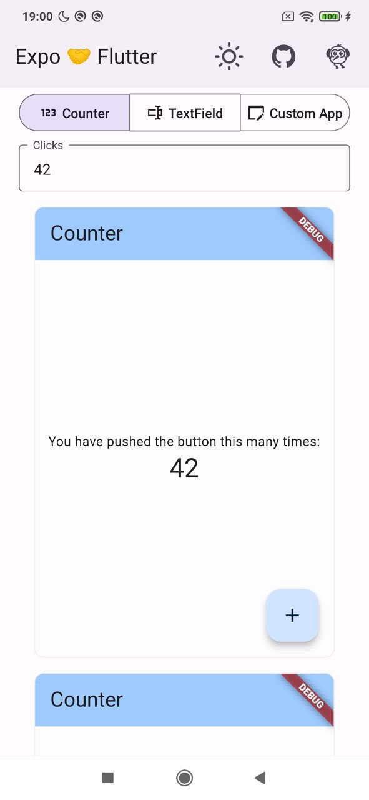
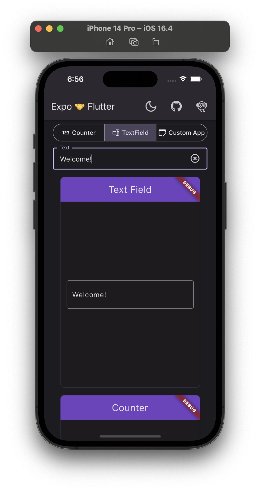
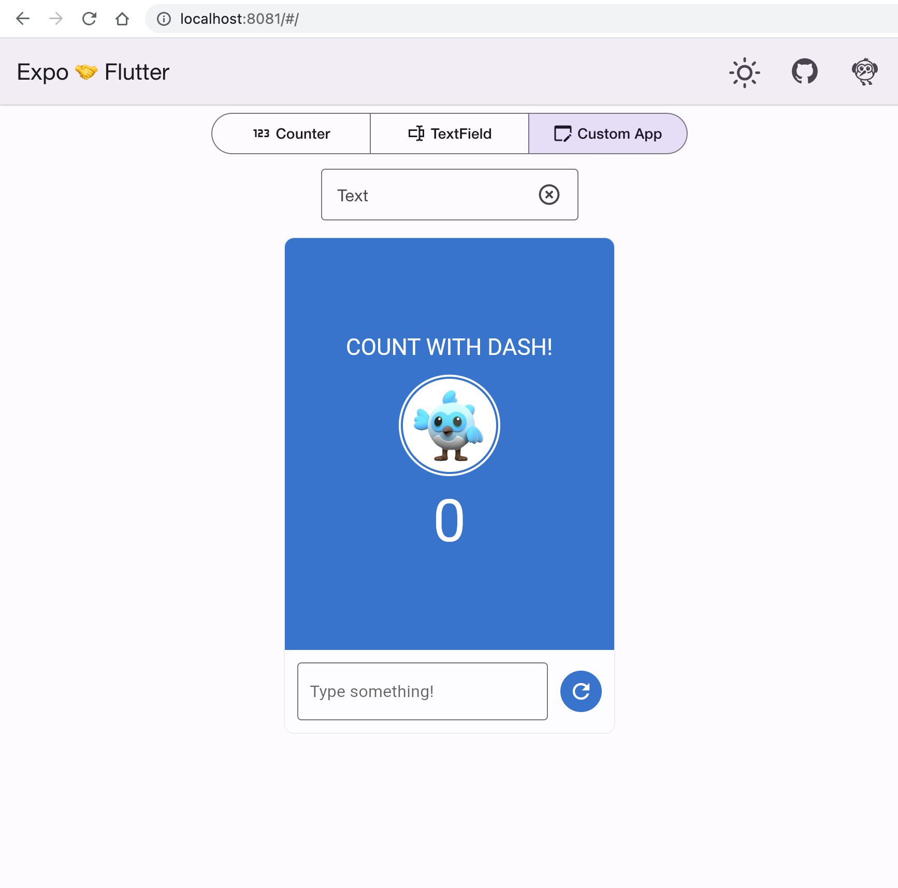

# flutter-embedding

Contains examples of how to embed Flutter in React apps

* **cra-flutter**: A simple React app (and component) bootstrapped with 
  [Create React App](https://github.com/facebook/create-react-app).  
  Renders Flutter app in a custom `hostElement`.  
  Inspired by [Angular example](https://github.com/flutter/samples/tree/main/web_embedding/ng-flutter) 
  from `flutter/samples`.  
  Deployed to [p-mazhnik.github.io/flutter-embedding/react](https://p-mazhnik.github.io/flutter-embedding/react).  
* **expo-flutter**: An Expo (React Native) app (and module).  
  On web, renders Flutter module in a custom `hostElement`.  
  Deployed to [p-mazhnik.github.io/flutter-embedding/expo](https://p-mazhnik.github.io/flutter-embedding/expo).  
  On Android, renders Flutter module in a `FlutterView`.  
  On iOS, renders Flutter module in a `FlutterViewController`.

<table>
  <thead>
    <tr>
      <th>Android</th>
      <th>iOS</th>
      <th>Web</th>
    </tr>
  </thead>
  <tbody>
    <tr>
      <td>
        
      </td>
      <td>
        
      </td>
      <td>
        
      </td>
    </tr>
  </tbody>
</table>
