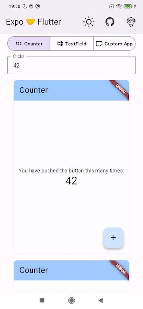
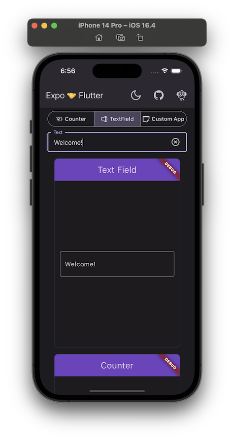

# expo-flutter

This React Native Expo project (Android, iOS, web) is an example of how 
a React Native app and Flutter module could be integrated and communicate with each other.

This project created with [Expo](https://expo.dev/) using
`npx create-expo-app -t expo-template-blank-typescript expo-flutter` command.  
Additionally, Expo module created using 
`npx create-expo-module@latest --local` command.

<details>
  <summary>Screenshots</summary>
  <table>
    <thead>
      <tr>
        <th>Android</th>
        <th>iOS</th>
        <th>Web</th>
      </tr>
    </thead>
    <tbody>
      <tr>
        <td>
          
        </td>
        <td>
          
        </td>
        <td>
          
        </td>
      </tr>
    </tbody>
  </table>
</details>

Web is deployed to [p-mazhnik.github.io/flutter-embedding/expo](https://p-mazhnik.github.io/flutter-embedding/expo).

## Points of Interest

### Flutter
The embedded Flutter app lives in the `flutter_module` directory of this repo.
That application is a standard Flutter module.

- The [pigeon](https://pub.dev/packages/pigeon) plugin is used to generate interop APIs and data classes on mobile.
- `@staticInterop` and `createDartExport` methods are used to allow certain Dart functions to be called 
  from JavaScript on web.

The same `DemoAppStateManager` model class is used within the Kotlin/Swift program,
the Dart program and in the interop between JS/Kotlin/Swift and Dart.

### Expo

- `modules/expo-flutter-view` is a standard Expo module, that contains a native view
  that renders a Flutter module with Expo modules API.
- `expo prebuild --clean` support achieved by using a standard Expo config plugin
  (`modules/expo-flutter-view/plugin`), that adds required iOS and Android configs to the host app.
#### Web
- `flutter.js` is added using "script" tag in `public/index.html`.
- Flutter is rendered in a custom `hostElement`.
#### Android
- Flutter aar files are added as dependencies to the `expo-flutter-view` module.
- Flutter is rendered in a [FlutterView](https://docs.flutter.dev/add-to-app/android/add-flutter-view).
#### iOS
- Flutter frameworks are embedded to the host app automatically using CocoaPods and 
  custom podspecs (see `modules/expo-flutter-view/ios/Podspecs`).
- Flutter is rendered in a [FlutterViewController](https://docs.flutter.dev/add-to-app/ios/add-flutter-screen).

## How to build the app

### Requirements

If you want to build and run this demo on your machine, you'll need
a moderately recent version of NodeJS:

```console
$ node -v

v20.3.1
```

And Flutter:

```
$ flutter --version

Flutter 3.10.5 • channel stable
Framework • revision 796c8ef792 (5 weeks ago) • 2023-06-13 15:51:02 -0700
Engine • revision 45f6e00911
Tools • Dart 3.0.5 • DevTools 2.23.1
```
**Ensure `npm` and `flutter` are present in your `$PATH`.**

### Building the app

In order to build this app, first fetch its `npm` dependencies:

```console
$ npm install
```

Then run the `flutter:build:<platfrom>` script for each platform you want to test:

```console
$ npm run flutter:build:android
$ npm run flutter:build:ios
$ npm run flutter:build:web
```

Then run `expo prebuild` command to prepare the Expo app:

```console
$ npx expo prebuild
```

Finally, run the `npm run <platfrom>` command to start the Expo app on the desired platform:

```console
$ npm run android
$ npm run ios
$ npm run web
```

## Learn More

Embedding into the regular React Native app with web support: 
[p-mazhnik/rn-package-flutter](https://github.com/p-mazhnik/rn-package-flutter)
